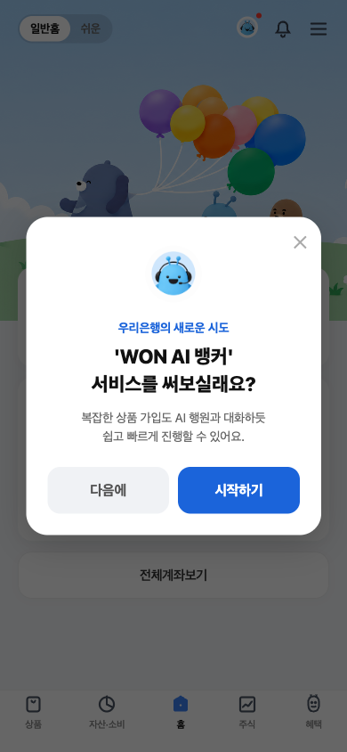
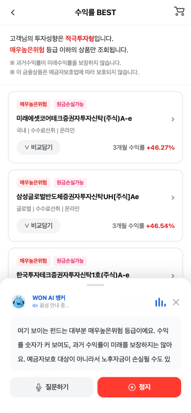
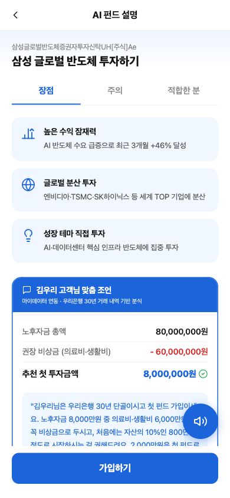
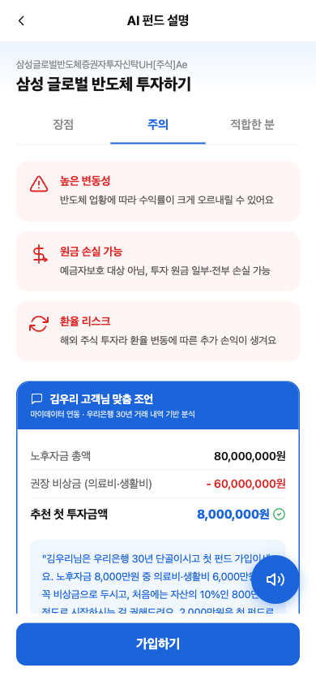
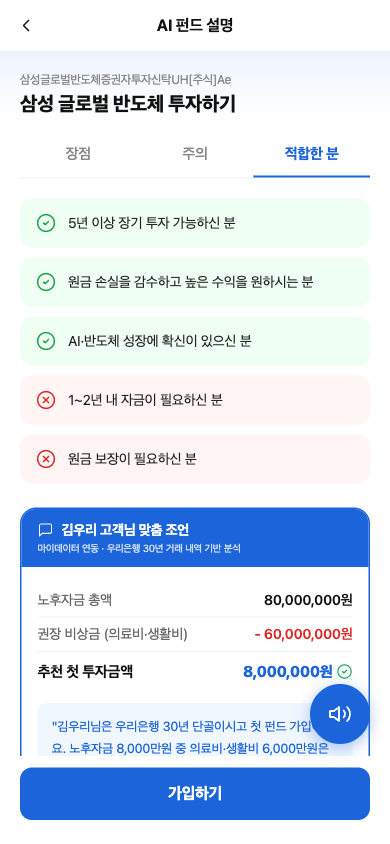
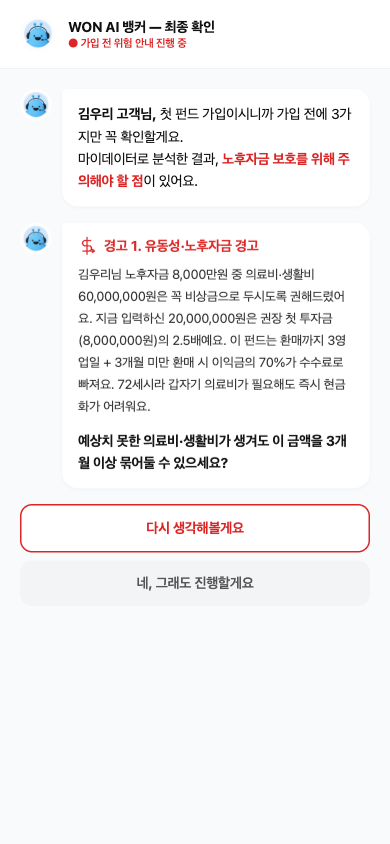

# 내 손안의 행원, 금융을 더 쉽고 안전하게

> 창구가 줄어도, 금융의 연결은 끊기지 않도록 — **고객 곁의 금융 동반자 IntersTeller**

**우리은행 X SSAFY · AI-금융소비자보호 아이디어 경진대회**

<p align="center">
  <a href="https://404h1.github.io/Woori/">
    
  </a>
</p>

---

## 문제 인식

**5년 사이, 동네 은행이 사라졌습니다.**

은행 오프라인 점포는 2012년 7,836개 → 2025년 5,534개로 **29.38% 감소**했습니다.  
점포가 문을 닫으면서 고령층·시니어 등 비대면 거래가 어려운 계층의 **금융 접근성이 위축**되고 있습니다.

모바일 뱅킹으로의 전환은 새로운 문제를 만들었습니다.

| 어려운 용어와 화면 구성 | 눈에 띄지 않는 글자 |
|---|---|
| 이해하기 어려운 아이콘 기능 | 이해하기 어려운 안내 및 지시사항 |

> 노년층 65%가 디지털에 미숙하지만 **38%는 은행 앱 사용을 희망**합니다.

---

## 솔루션 — WON AI 뱅커

**IntersTeller는 불완전거래·접근성 격차를 단일 인터페이스로 동시 해소합니다.**

| | 기존 방식 | IntersTeller |
|---|---|---|
| **진입** | 어려운 용어, 복잡한 UI | 첫 화면에서 바로 (음성 우선) |
| **안내** | 이해하기 힘든 텍스트 지시사항 | 음성 + 단계별 동행 · 단어 하이라이트 |
| **경고** | "원금손실 위험" 형식적 한 줄 | 마이데이터 기반 분석 · 3단계 사전 경고 |
| **경험** | 영업점 방문 필수 또는 텍스트 챗봇 | 모바일에서도 '나만의 행원' 대면 경험 |

---

## 주요 기능

### AI 뱅커 온보딩


앱 진입 시 WON AI 뱅커가 음성 안내 서비스를 제안합니다.

---

### 펀드 목록 — 실시간 음성 안내 + 단어 하이라이트


AI가 화면을 읽어주며 현재 읽는 단어를 실시간으로 강조합니다.

---

### AI 펀드 설명 — 장점 · 주의 · 적합한 분

<p>
  
  
  
</p>

마이데이터 기반으로 **고객 맞춤 조언**까지 제공합니다.

---

### 가입 전 AI 리스크 경고 — 3단계 사전 경고


단순 약관 동의가 아닙니다. 고객의 자산 상황을 분석해 실질적 위험을 직접 경고합니다.

> "노후자금 8,000만원 중 의료비·생활비 6,000만원은 비상금으로 두시길 권해드려요."

---

### 가입 완료


---

## 특별함 (Noverty)

**1. 효과성**
- 시니어·시각장애인·금융 취약계층까지 아우르는 범용 AI 솔루션
- 마이데이터 기반 노후자금·비상금·권장투자 자동 계산으로 고객별 맞춤 가이드

**2. 실현가능성**
- Xcode 기반 iOS 앱 환경 테스트 완료
- Naver Clova Voice + Redis 캐싱 구조로 저비용 운영
- 금소법 제19조(설명의무)·제47조(위법계약해지권) 기반 7중 리스크 안내 체계

**3. 혁신성**
- 음성+시각 멀티모달 동기화 → 단어 단위 하이라이트로 KWCAG 2.2 접근성 충족
- STT 기반 완전판매 음성 검증 → 단순 동의 체크박스가 아닌 고객 음성 응답으로 이해도 검증

---

## 기술 스택

| 레이어 | 기술 |
|---|---|
| Frontend | React · Vite · Capacitor (iOS) |
| AI 음성 | Naver Clova Voice · Web Speech API (STT) |
| AI 설명 | Claude API |
| 백엔드 | FastAPI · Redis |
| 배포 | GitHub Pages |

---

## 프로젝트 구조

```
app/        ← 프론트엔드 (React + Vite)
backend/    ← 백엔드 (FastAPI · RAG · STT/TTS)
docs/       ← GitHub Pages 배포 빌드
```
