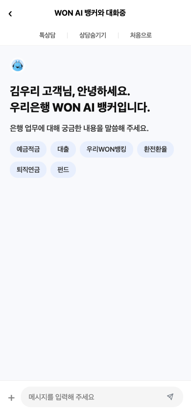

# 불완전거래 해소를 위한 'WON AI 뱅커'

> 챗봇이 아닌, 옆에 앉은 행원처럼 — **우리은행 해커톤 2026**

<p align="center">
  <a href="https://404h1.github.io/Woori/">
    
  </a>
</p>

---

## 문제 인식

**불완전판매**는 금융권의 오래된 숙제입니다.

- 복잡한 금융상품 약관을 고객이 스스로 이해하기 어렵습니다
- 고령층일수록 디지털 환경에서 중요한 내용을 놓치기 쉽습니다
- 행원이 옆에서 설명해주는 경험을 비대면으로 구현할 방법이 없었습니다

---

## 솔루션 — WON AI 뱅커

**복잡한 펀드 가입 과정을 AI 행원이 처음부터 끝까지 음성으로 안내합니다.**

사용자가 화면을 터치하지 않아도, AI가 현재 페이지를 읽어주고, 질문에 답해주고, 위험 요소를 직접 경고합니다.

---

## 주요 기능

### 1. AI 뱅커 온보딩


앱 진입 시 WON AI 뱅커가 등장해 음성 안내 서비스를 제안합니다.

---

### 2. AI 채팅 상담


가입 전 궁금한 것을 자연어로 물어보면 AI가 즉시 답변합니다.

---

### 3. 펀드 목록 — 실시간 음성 안내


펀드 목록 화면에서 AI가 자동으로 위험도와 수익률을 음성으로 설명합니다.

---

### 4. AI 펀드 설명 — 장점 · 주의 · 적합한 분

<p>
  
  
  
</p>

선택한 펀드의 장점, 주의사항, 나에게 적합한지를 AI가 탭별로 분석해줍니다.  
마이데이터 기반으로 **고객 맞춤 조언**까지 제공합니다.

---

### 5. 가입 전 AI 리스크 경고


단순 약관 동의가 아닙니다. AI가 **고객의 자산 상황**을 분석해 실질적인 위험을 직접 경고하고, 재고를 유도합니다.

> "노후자금 8,000만원 중 의료비·생활비로 사용할 6,000만원은 비상금으로 두시길 권해드려요."

---

### 6. 가입 완료


모든 단계를 AI 안내와 함께 완주하면 가입이 완료됩니다.

---

## 기술 스택

| 레이어 | 기술 |
|---|---|
| Frontend | React · Vite · Capacitor (iOS) |
| AI 음성 안내 | Web Speech API · TTS (음성 클론) |
| AI 설명 | Claude API |
| 배포 | GitHub Pages |

---

## 프로젝트 구조

```
app/        ← 프론트엔드 (React + Vite)
backend/    ← 백엔드 (FastAPI · RAG · STT/TTS)
docs/       ← GitHub Pages 배포 빌드
```

